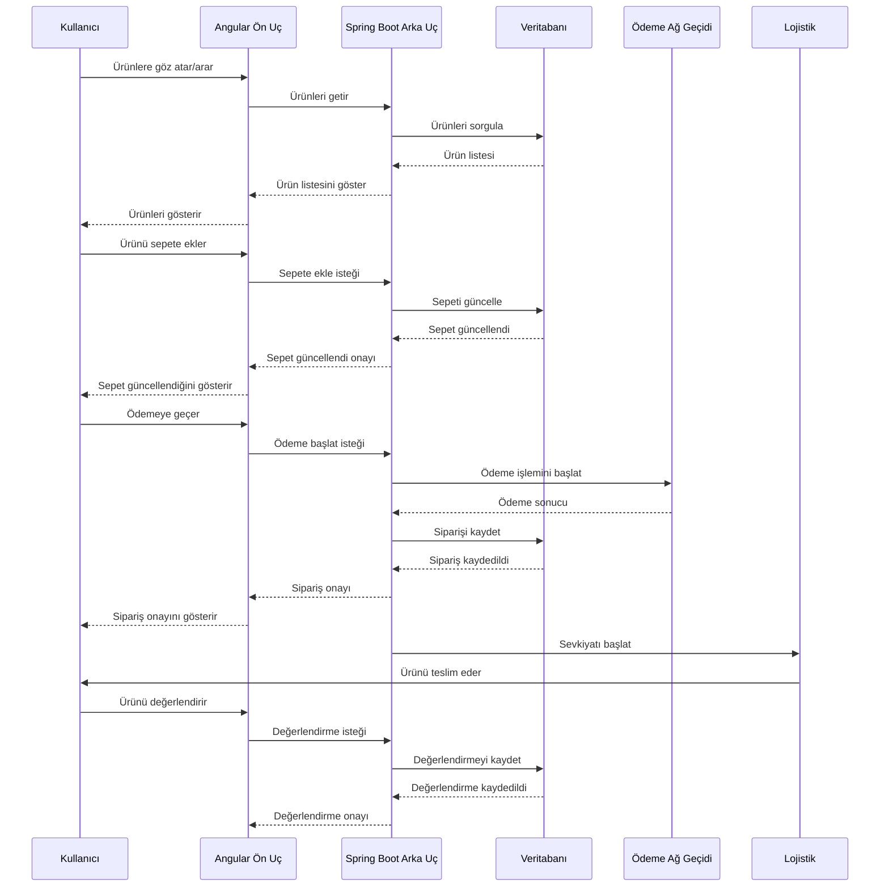

# Full-Stack E-Commerce Web Application & Admin Portal

Bu proje, Angular (Ön Uç) ve Spring Boot (Arka Uç) kullanılarak geliştirilen tam kapsamlı bir e-ticaret web uygulamasıdır. Bu proje, CSE 214 Advanced Application Development dersi kapsamında geliştirilmiştir.

## Proje Hedefi

Güvenli kullanıcı kimlik doğrulaması, etkileşimli bir alışveriş deneyimi ve ürünleri, kullanıcıları ve işlemleri yönetmek için entegre bir yönetici portalı sunan bir e-ticaret platformu oluşturmak.

## Kapsam & Özellikler

### 1. Ön Uç (Angular)

*   **Single Page Application (SPA):** Performansı optimize etmek için lazy loading ile Angular kullanılarak uygulanmıştır.
*   **Kimlik Doğrulama & Yetkilendirme:** Kullanıcılar (Müşteriler) ve Yöneticiler için rol tabanlı erişim kontrolü.
*   **Guards & Yönlendirme:** AuthGuard kullanılarak rota koruması, yalnızca yetkili kullanıcıların belirli sayfalara erişebilmesini sağlar.
*   **E-Ticaret Özellikleri:**
    *   Ürünlere göz atma, arama ve filtreleme.
    *   Ürün karşılaştırmaları ve incelemeleri.
    *   Alışveriş sepeti ve ödeme süreci.
    *   Sipariş takip sistemi.
*   **Yönetici Portalı (Premium Rol):**
    *   Ürün ve envanter yönetimi.
    *   Sipariş ve sevkiyat takibi.
    *   Kullanıcı yönetimi (kullanıcıları engelleme/engeli kaldırma, işlemleri görüntüleme).
    *   Ödemeler ve siparişlerle ilgili sorunların çözümü.

### 2. Arka Uç (Spring Boot)

*   **Kullanıcı Yönetimi:** Güvenli kimlik doğrulama ve rol tabanlı yetkilendirme.
*   **Ürün & Sipariş Yönetimi:** Ürünleri, siparişleri ve ödemeleri yönetmek için CRUD işlemleri.
*   **Ödeme İşleme:** Üçüncü taraf ödeme ağ geçitleri (ör. Stripe, PayPal) ile entegrasyon.
*   **Yönetici Portalı İşlevleri:** Veri analizi, raporlar ve kullanıcı sorunlarını çözme.
*   **Veritabanı (MySQL):** Kullanıcı, ürün, sipariş ve ödeme verilerini depolamak için Hibernate/JPA eşlemeleri ile ilişkisel veritabanı.

## Teknoloji Yığını

*   **Ön Uç (Angular):**
    *   State Management: RxJS
    *   Lazy Loading: Optimize edilmiş modül yükleme
    *   Guards: AuthGuard ile rota koruması
    *   UI Framework: Angular Material / Tailwind CSS
*   **Arka Uç (Spring Boot):**
    *   Güvenlik: Spring Security + JWT (Kimlik Doğrulama için)
    *   Veritabanı: Hibernate ORM ile MySQL
    *   API Geliştirme: Swagger Dokümantasyonu ile RESTful API
*   **Ödeme Entegrasyonu:** Stripe, PayPal (Test Ortamları)

## Klasör Yapısı

```
ecommerce-app/
├── backend/         # Spring Boot Arka Uç Kodu
├── frontend/        # Angular Ön Uç Kodu
└── README.md        # Proje Açıklaması
```

## Yüksek Seviye Mimari Diyagramı

```mermaid
graph TD
    User[Kullanıcı (Tarayıcı)] --> Frontend[Angular Ön Uç];
    Frontend -->|REST API İstekleri| Backend[Spring Boot Arka Uç];
    Backend -->|Veritabanı İşlemleri| Database[(MySQL Veritabanı)];
    Backend -->|Ödeme İşlemleri| PaymentGateway[Ödeme Ağ Geçitleri (Stripe/PayPal)];
```

## Arka Uç Mimarisi (Spring Boot Akışı)

```mermaid
graph LR
    Client[Client (Angular)] --> Controller[Controller (REST API)];
    Controller --> Service[Service Layer];
    Service --> Repository[Repository (JPA/Hibernate)];
    Repository --> Database[(MySQL Veritabanı)];
```

## Kullanım Senaryoları

### 1. Kullanıcı Satın Alma Akışı

**Aktörler:** Kullanıcı (Müşteri), Sistem, Satıcı, Ödeme Ağ Geçidi, Lojistik Sağlayıcı, Yönetici

1.  Kullanıcı ürün kategorilerine göz atar veya bir ürün arar.
2.  Kullanıcı ürün detaylarını görüntüler, ürünleri karşılaştırır ve incelemeleri okur.
3.  Kullanıcı ürünleri alışveriş sepetine ekler.
4.  Kullanıcı ödemeye geçer ve güvenli bir ödeme yapar.
5.  Sistem siparişi onaylar ve kullanıcıyı bilgilendirir.
6.  Satıcı siparişi işler ve lojistik firması ürünü gönderir.
7.  Kullanıcı teslimata kadar siparişi takip eder.
8.  Kullanıcı ürünü teslim alır ve bir inceleme bırakır.
9.  Gerekirse, kullanıcı iade veya geri ödeme talebinde bulunur.



### 2. Yönetici Portalı Kullanım Senaryoları

**Aktörler:** Yönetici (Süper Kullanıcı), Sistem, Kullanıcılar, Satıcılar, Ödeme Ağ Geçidi, Lojistik Sağlayıcı

**Yönetici Kimlik Doğrulama & Erişim Kontrolü:**

*   Yalnızca yetkili yöneticiler (premium rol) yönetici paneline erişebilir.
*   Yöneticiler kimlik bilgileriyle giriş yapar ve erişim izni verilmeden önce doğrulanır.

**Yönetici Paneli İşlevleri:**

1.  **Kullanıcı Yönetimi:** Kullanıcı ayrıntılarını görüntüleme, şüpheli hesapları devre dışı bırakma ve şifreleri sıfırlama.
2.  **Sipariş ve Ödeme Sorunlarını Çözme:** Başarısız işlemleri, geri ödemeleri veya sevkiyat gecikmelerini çözme.
3.  **Ürün ve Envanter Yönetimi:** Ürün ekleme, güncelleme veya kaldırma.
4.  **Sevkiyat ve Lojistik:** Bekleyen ve tamamlanan siparişleri takip etme.
5.  **Müşteri Desteği:** Şikayetleri, iadeleri ve geri ödeme taleplerini görüntüleme ve yanıtlama.

```mermaid
actor Admin
rectangle "E-Ticaret Sistemi" {
    usecase "Kullanıcı Yönetimi (UC1)" as UC1
    usecase "Sipariş ve Ödeme Sorunlarını Çözme (UC2)" as UC2
    usecase "Ürün ve Envanter Yönetimi (UC3)" as UC3
    usecase "Sevkiyat ve Lojistik Takibi (UC4)" as UC4
    usecase "Müşteri Desteği (Şikayet/İade) (UC5)" as UC5
    usecase "Yönetici Panelinde Oturum Açma (UC_Login)" as UC_Login
}

Admin --> UC_Login
Admin --> UC1
Admin --> UC2
Admin --> UC3
Admin --> UC4
Admin --> UC5
```

## Ödeme Entegrasyonu (Test Ortamları)

Hem Stripe hem de PayPal, öğrencilerin gerçek işlemleri işlemeden test ödeme istekleri göndermelerine olanak tanıyan sanal (test) ortamları sağlar.

### 1. Stripe Test API

Stripe, öğrencilerin test kartları kullanarak ödeme yapabileceği bir test modu sunar.

**Stripe Test API Nasıl Kullanılır?**

1.  **Kaydolun:** [https://dashboard.stripe.com/register](https://dashboard.stripe.com/register) adresinden ücretsiz bir hesap oluşturun.
2.  **API Anahtarlarını Alın:**
    *   Kontrol panelinde Developers → API keys bölümüne gidin.
    *   Test Secret Key ve Test Publishable Key'i kullanın.
3.  **Test Kartlarını Kullanın:** Stripe test kart numaraları sağlar.
4.  **Ödeme İsteği Yapın:** Şu adrese bir POST isteği gönderin: `https://api.stripe.com/v1/payment_intents`
5.  **Test İşlemlerini Görüntüleyin:** Tüm test ödemeleri Stripe Kontrol Panelinde "Test Mode" altında görünür.

### 2. PayPal Sandbox API

PayPal, geliştiricilerin işlemleri test etmesi için bir Sandbox Modu'na sahiptir.

**PayPal Sandbox API Nasıl Kullanılır?**

1.  [PayPal Developer](https://developer.paypal.com/) adresinde bir Geliştirici Hesabı oluşturun.
2.  **Sandbox Hesapları Kurun:**
    *   PayPal Geliştirici Kontrol Panelinde test alıcı ve satıcı hesapları oluşturun.
3.  **API Kimlik Bilgilerini Alın:**
    *   My Apps & Credentials → Yeni bir uygulama oluştur'a gidin.
    *   Test için Client ID ve Secret Key'i alın.
4.  **PayPal API Uç Noktasını Kullanın:** `https://api-m.sandbox.paypal.com`
5.  **Test Ödemesi Yapın:**
    *   İşlemler için PayPal'ın test hesaplarını kullanın.
